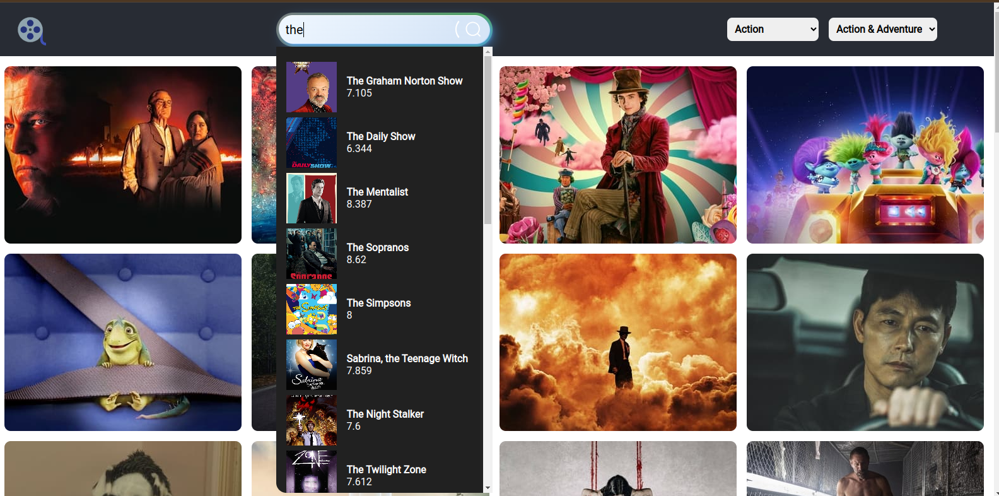
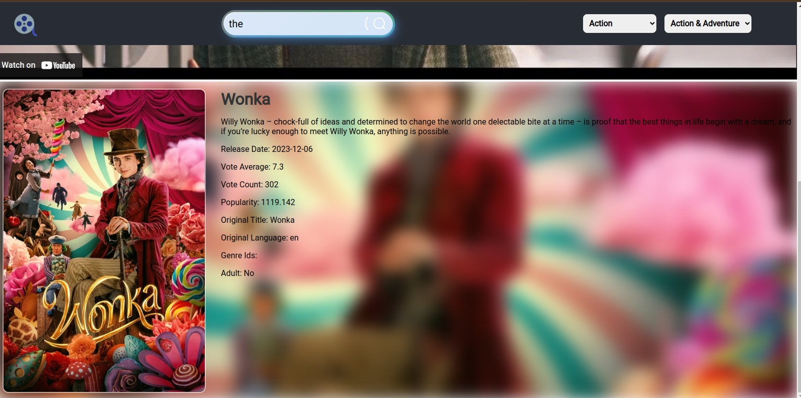

[Live Demo](https://myflix-lake-six.vercel.app/)

# Movie & TV Shows App






## Introduction
 - A movie and tv shows app with The Movie DB API .

## Prerequisites
- Node.js (v16+)
  - React
  - Redux
  - Tailwind CSS
  - REST API
-

## Installation

1. Clone the repository:

   ```bash
   git clone https://github.com/mamun-mahmood/myflix.git
   cd myflix
   ```

2. Install dependencies:

   ```bash
   npm install
   "if there's dependency conflict run"
   npm install -f
   ```

3. Run the application:

   ```bash
   npm run dev
   ```

## Usage
- Search for movies and tv shows
- View trailer and details of movies and tv shows 
- Find all the popular movies and tv shows or filter by genre.


## Deployment

- Deployed on Vercel
- [Live Demo](https://myflix-lake-six.vercel.app/)

## Contributing

- Pull requests are welcome. For major changes, please open an issue first to discuss what you would like to change.
- Please make sure to update tests as appropriate.

## License

[MIT](https://choosealicense.com/licenses/mit/)
